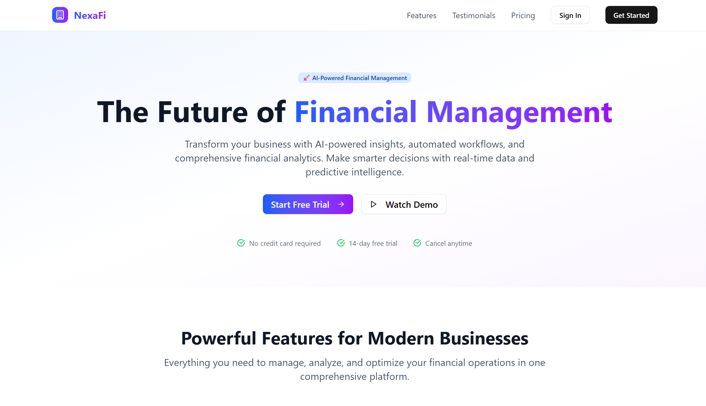

# NexaFi


## AI-Driven Fintech Platform for SMBs

NexaFi is a financial operating system for small and mid-sized businesses: ten genuinely separate Flask microservices (gateway, auth, ledger, payment, credit, document, compliance, notification, open banking, and user), each independently runnable, communicating over synchronous HTTP through the gateway rather than an async message bus. A real RabbitMQ client library exists but isn't currently used by any service. Two frontends (both React and Vite, despite one being named "mobile-frontend") complete the application.

<div align="center">
  
</div>

## Table of Contents

- [Overview](#overview)
- [Project Structure](#project-structure)
- [Feature Status](#feature-status)
- [Technology Stack](#technology-stack)
- [Architecture](#architecture)
- [Installation and Setup](#installation-and-setup)
- [Running the Stack](#running-the-stack)
- [API Surface](#api-surface)
- [Testing](#testing)
- [CI/CD Pipeline](#cicd-pipeline)
- [Documentation](#documentation)
- [Contributing](#contributing)
- [License](#license)

## Overview

NexaFi demonstrates a fintech operating system across a real, runnable set of microservices. Cash-flow forecasting (Gradient Boosting) trains on real caller-supplied transaction history when there's enough of it, with a synthetic seasonal fallback for businesses with no history yet. Credit scoring (Random Forest) and transaction anomaly detection work differently: the credit model is trained entirely on synthetic, self-generated data with no real credit outcomes involved, and the anomaly detector is a deterministic statistical and rules engine (z-scores, velocity checks, time-of-day risk) rather than a trained unsupervised model. Real SAP and Oracle integration clients exist, with genuine OAuth2/SAML flows against real SAP OData endpoints, but neither is called by any of the ten backend services yet.

## Project Structure

```
NexaFi/
├── code/
│   ├── backend/                      # Ten independent Flask microservices
│   │   ├── api-gateway/              # Routes requests to the other services over HTTP
│   │   ├── auth-service/             # JWT auth, MFA
│   │   ├── user-service/             # User profiles
│   │   ├── ledger-service/           # Accounting, transactions
│   │   ├── payment-service/          # Payment processing
│   │   ├── credit-service/           # Underwriting, lending
│   │   ├── document-service/         # OCR, document parsing
│   │   ├── compliance-service/       # Compliance checks (not containerized by default)
│   │   ├── notification-service/     # Notifications (not containerized by default)
│   │   ├── open-banking-gateway/     # Open banking (not containerized by default)
│   │   └── shared/                   # Config, middleware, a RabbitMQ client (unused), utils
│   ├── ml_services/
│   │   ├── ai-service/               # CashFlowForecaster, CreditScorer, TransactionAnomalyDetector
│   │   └── analytics-service/        # Business intelligence and reporting
│   └── platform_services/
│       ├── enterprise-integrations/  # Real SAP and Oracle clients (not wired to a live endpoint)
│       ├── scalability/              # Caching, distributed-computing helpers
│       └── security/                 # Threat detection, zero-trust helpers
├── web-frontend/                     # React (Vite) dashboard
├── mobile-frontend/                  # A second React (Vite) app, not React Native or Expo
├── infrastructure/                   # Docker, Kubernetes, Helm, Terraform, Ansible, monitoring
├── scripts/                          # Setup, run, stop, build, lint, and test scripts
├── docs/                             # Documentation (this directory)
└── README.md
```

## Feature Status

### Application tier (wired and tested)

| Component                         | Details                                                                                                                                                                                                                                                            |
| :-------------------------------- | :----------------------------------------------------------------------------------------------------------------------------------------------------------------------------------------------------------------------------------------------------------------- |
| **Ten independent services**      | api-gateway, auth-service, user-service, ledger-service, payment-service, credit-service, document-service, compliance-service, notification-service, and open-banking-gateway, each a separate Flask app with its own `main.py`.                                  |
| **Auth**                          | JWT sessions and an MFA module in `auth-service`. Its `SECRET_KEY` falls back to a static placeholder value with no check that rejects it in production.                                                                                                           |
| **Service-to-service calls**      | The API gateway forwards requests to the other services synchronously over HTTP (`requests.get`/`requests.post`), not through an async message bus.                                                                                                                |
| **Cash-flow forecasting**         | A `GradientBoostingRegressor` that builds features from the caller's own recent daily cash flows when at least a week of history is supplied, falling back to a synthetic seasonal series (trend plus weekly cycle plus noise) for businesses with no history yet. |
| **Transaction anomaly detection** | A deterministic statistical and rules engine, not a trained model: per-user z-scores on transaction amount, a velocity check, and time-of-day risk factors, combined into a 0 to 1 anomaly score.                                                                  |
| **Web dashboard**                 | React 19 app (plain JavaScript, Vite, Tailwind CSS v4), covering the core dashboard, ledger, payments, credit, and settings screens.                                                                                                                               |
| **"Mobile" frontend**             | A second React 19 and Vite app (also plain JavaScript, also Tailwind CSS v4), not a React Native or Expo project.                                                                                                                                                  |

### Research tier (library modules, not wired to a live endpoint)

| Component                  | Details                                                                                                                                                                                                  |
| :------------------------- | :------------------------------------------------------------------------------------------------------------------------------------------------------------------------------------------------------- |
| **Credit scoring**         | A `RandomForestClassifier` trained entirely on synthetic, self-generated data: both the features and the labels come from a hand-written synthetic generator, with no real credit-outcome data involved. |
| **SAP integration**        | A real client with OAuth2 and SAML token flows against genuine SAP OData endpoints (for example `API_BUSINESS_PARTNER`); not imported by any of the ten backend services.                                |
| **Oracle integration**     | A comparable Oracle client, also not imported by any backend service.                                                                                                                                    |
| **RabbitMQ message queue** | A working `pika`-based publish and consume client in `shared/utils/message_queue.py`; not imported anywhere else in the codebase, despite RabbitMQ running as a container in Docker Compose.             |

## Technology Stack

| Area                              | Technology                                                                        |
| :-------------------------------- | :-------------------------------------------------------------------------------- |
| Backend services                  | Python 3.11+, Flask, one Flask app per microservice                               |
| Auth                              | PyJWT, an in-house MFA module                                                     |
| Data layer                        | SQLAlchemy, PostgreSQL, Redis (caching)                                           |
| Messaging (library, unused)       | RabbitMQ (pika)                                                                   |
| ML                                | scikit-learn (Gradient Boosting, Random Forest, Ridge), NumPy                     |
| Enterprise integrations (library) | Real SAP (OAuth2/SAML) and Oracle clients, not called by any live service         |
| Web frontend                      | React 19, JavaScript, Vite, Tailwind CSS v4                                       |
| "Mobile" frontend                 | React 19, JavaScript, Vite, Tailwind CSS v4 (a second web app, not native mobile) |
| Infrastructure                    | Docker, Docker Compose, Kubernetes, Helm, Terraform, Ansible                      |
| Monitoring                        | Elasticsearch, Kibana                                                             |
| CI/CD                             | GitHub Actions                                                                    |
| Testing                           | pytest (backend, ml_services, platform_services), Vitest (web and mobile)         |

## Architecture

```
Clients
  ├── web-frontend (React, Vite)          ── HTTP/JSON ──┐
  └── mobile-frontend (React, Vite)      ── HTTP/JSON ──┤
                                                        ▼
API Gateway (Flask)
  Forwards requests synchronously (requests.get/post) to:
  auth-service · user-service · ledger-service · payment-service
  credit-service · document-service · compliance-service
  notification-service · open-banking-gateway

AI service (code/ml_services/ai-service)
  CashFlowForecaster (Gradient Boosting, real data + synthetic fallback)
  CreditScorer (Random Forest, fully synthetic training data)
  TransactionAnomalyDetector (statistical rules engine)

Platform services (code/platform_services)
  SAP and Oracle integration clients (real, not wired to a live endpoint)

Data layer
  PostgreSQL · Redis · RabbitMQ (container runs; no service currently publishes to it)
```

See [docs/ARCHITECTURE.md](docs/ARCHITECTURE.md) for detail.

## Installation and Setup

Prerequisites: Python 3.11+, Node.js 18+, pnpm, and Docker.

```bash
git clone https://github.com/quantsingularity/NexaFi.git
cd NexaFi

# Backend: each service has its own virtual environment
for service_dir in code/backend/*/; do
  if [ -f "${service_dir}requirements.txt" ]; then
    (cd "$service_dir" && python3 -m venv venv && source venv/bin/activate \
      && pip install -r requirements.txt && deactivate)
  fi
done

# Web frontend
cd web-frontend && pnpm install && cd ..

# "Mobile" frontend
cd mobile-frontend && pnpm install && cd ..
```

For an automated setup:

```bash
git clone https://github.com/quantsingularity/NexaFi.git
cd NexaFi
./scripts/setup.sh
./scripts/run.sh
```

`scripts/setup.sh` also installs Docker if it isn't already present, so it may prompt for `sudo`.

Full, environment-specific instructions are in [docs/INSTALLATION.md](docs/INSTALLATION.md).

## Running the Stack

```bash
# 1) Full stack, including Postgres, Redis, RabbitMQ, Elasticsearch, and every
#    containerized service (from infrastructure/)
./start-infrastructure.sh
# or
docker compose up -d

# 2) Web dashboard (from web-frontend)
pnpm run dev

# 3) "Mobile" frontend (from mobile-frontend)
pnpm run dev
```

`compliance-service`, `notification-service`, and `open-banking-gateway` are not containers in the default Docker Compose file; run them directly from their own directories (`python src/main.py`) if you need them locally.

See [docs/USAGE.md](docs/USAGE.md) and [docs/CONFIGURATION.md](docs/CONFIGURATION.md).

## API Surface

Each service exposes its own `/health` check. The gateway is the single entry point for clients.

| Service                       | What it's for                                               |
| :---------------------------- | :---------------------------------------------------------- |
| api-gateway                   | Single entry point; forwards requests to the other services |
| auth-service                  | Login, session refresh, MFA                                 |
| user-service                  | User profile management                                     |
| ledger-service                | Accounts, transactions, journal entries                     |
| payment-service               | Payment processing                                          |
| credit-service                | Credit scoring and lending workflows                        |
| document-service              | Document upload and parsing                                 |
| compliance-service            | Compliance checks and reporting                             |
| notification-service          | Notifications                                               |
| open-banking-gateway          | Open banking account linking                                |
| ai-service (code/ml_services) | Cash-flow forecasting, credit scoring, anomaly detection    |

Full request and response shapes are in [docs/API.md](docs/API.md).

## Testing

```bash
# Any backend service (from its own directory, venv active)
pytest

# All backend, ml_services, and platform_services tests, via the project script
./scripts/test_all.sh

# Web (from web-frontend)
pnpm test

# "Mobile" frontend (from mobile-frontend)
pnpm test
```

`code/backend/tests` has 7 files, `code/ml_services/tests` and `code/platform_services/tests` each have 1. The web dashboard has 5 test files (Vitest), and the mobile-frontend Vite app has 8.

## CI/CD Pipeline

GitHub Actions (`.github/workflows/cicd.yml`) runs three jobs on push, pull request, and manual dispatch:

| Job                 | Depends on          | What it does                                                                                   |
| :------------------ | :------------------ | :--------------------------------------------------------------------------------------------- |
| Code Quality Checks | -                   | Python formatter checks (autoflake, black) and a repository-wide Prettier check                |
| Backend Tests       | Code Quality Checks | Runs the pytest suite with coverage and uploads the coverage report as an artifact             |
| Web Build           | Code Quality Checks | Installs dependencies and produces the production build for `web-frontend` only (no test step) |

There is currently no CI job that builds or tests `mobile-frontend`, `ml_services`, or `platform_services`.

## Documentation

| Document                                                     | Contents                                |
| :----------------------------------------------------------- | :-------------------------------------- |
| [docs/README.md](docs/README.md)                             | Documentation index                     |
| [docs/ARCHITECTURE.md](docs/ARCHITECTURE.md)                 | System architecture                     |
| [docs/API.md](docs/API.md)                                   | REST API reference                      |
| [docs/INSTALLATION.md](docs/INSTALLATION.md)                 | Setup for all components                |
| [docs/CONFIGURATION.md](docs/CONFIGURATION.md)               | Environment variables and config        |
| [docs/USAGE.md](docs/USAGE.md)                               | Running and using the platform          |
| [docs/CLI.md](docs/CLI.md)                                   | Helper scripts reference                |
| [docs/FEATURE_MATRIX.md](docs/FEATURE_MATRIX.md)             | Feature status, implemented vs planned  |
| [docs/ML_MODEL_PERFORMANCE.md](docs/ML_MODEL_PERFORMANCE.md) | Model design and validation methodology |
| [docs/PERFORMANCE.md](docs/PERFORMANCE.md)                   | System performance notes                |
| [docs/SECURITY.md](docs/SECURITY.md)                         | Security model and disclosure process   |
| [docs/TROUBLESHOOTING.md](docs/TROUBLESHOOTING.md)           | Common issues and fixes                 |
| [docs/CONTRIBUTING.md](docs/CONTRIBUTING.md)                 | Contribution guide                      |
| [docs/EXAMPLES/](docs/EXAMPLES/)                             | Worked examples                         |

## Contributing

See [docs/CONTRIBUTING.md](docs/CONTRIBUTING.md).

## License

This project is licensed under the MIT License - see the [LICENSE](LICENSE) file for details.
